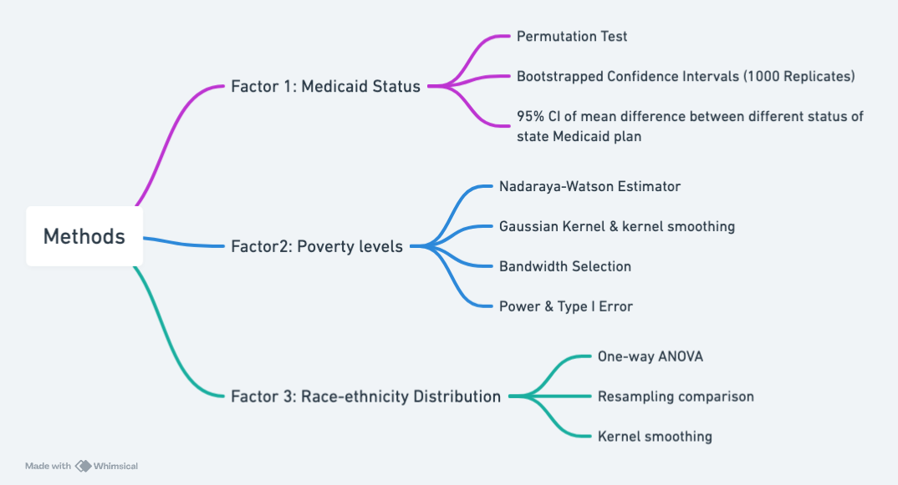

# Exploring the Correlative Patterns Between COVID-19 Vaccination Rates and Socio-Economic Factors in the U.S.

## Project Overview

This project investigates how race-ethnicity distribution, poverty levels, and state Medicaid expansion status influence COVID-19 vaccination rates across the United States.
Using county- and state-level data, we explore the socio-economic determinants behind vaccination disparities and evaluate how public policy, especially Medicaid expansion, shapes vaccination outcomes. This project was part of the final project for DATASCI 406(Computation Methods).

## Methods

1. Overview 

The analysis integrates state-level and county-level data to test the following hypotheses:

H1: States that adopted Medicaid expansion exhibit higher COVID-19 vaccination rates.

H2: County-level poverty is inversely associated with vaccination rates.

H3: Vaccination uptake differs significantly across racial and ethnic groups.

To test these hypotheses, a combination of non-parametric inference, smoothing estimation, and variance analysis was implemented using R.

2. Medicaid Expansion and Vaccination Rate

We compared states with and without Medicaid expansion using a permutation test to assess mean differences in vaccination rates, and a bootstrap method (1,000     replicates) to calculate a 95% confidence interval for those differences.

3. Poverty Level and Vaccination Rate

We modeled the non-linear relationship between county-level poverty and vaccination using the Nadaraya–Watson kernel smoother with a Gaussian kernel. Ultimately, we selected the optimal bandwidth through cross-validation to minimize mean squared error.

4. Race-Ethnicity and Vaccination Distribution

We applied exploratory data analysis and a one-way ANOVA to identify differences in vaccination rates across racial and ethnic groups, supported by resampling simulations to check power and Type I error.

## Key Findings

States that adopted Medicaid expansion showed notably higher COVID-19 vaccination rates for both one-dose and two-dose completions, supported by permutation test p-values of 0.016 and 0.04, respectively. The bootstrapped 95% confidence intervals indicating mean differences between 2.20–14.85 and 4.97–13.88. Regarding the correlation between the poverty level and COVID-19 vaccination rate, at the county level, vaccination rates generally declined as poverty rates increased up to about 23%, after which the trend fluctuated. This reflected a non-linear relationship influenced by limited data from high-poverty areas. In addition, analysis by race and ethnicity revealed statistically significant disparities (p < 2e−16). It shows that demographic factors play a major role in vaccination outcomes across the United States.

## Data Source
- Our World in Data (OWID) — U.S. state-level vaccination progress (Jan 2021–May 2023)

- Kaiser Family Foundation (KFF) — Medicaid expansion status by state

- USAFacts — Updated vaccination and demographic statistics

- CDC COVID-19 Vaccination Demographics — National vaccination by race/ethnicity

- Kaggle (Tunguz & García datasets) — County-level vaccination and equity data

- U.S. Census Bureau (SAIPE Program) — 2021 county-level poverty estimates
